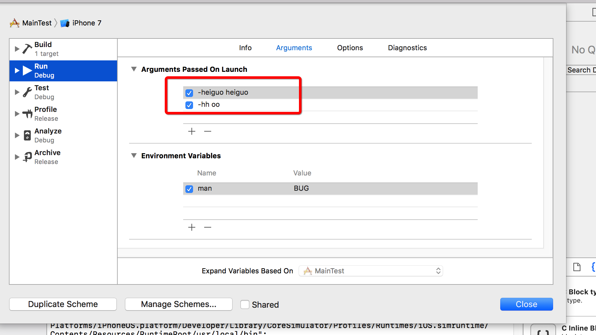
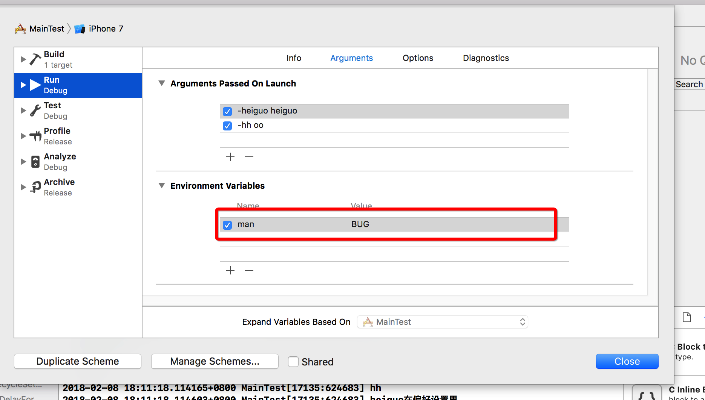

# Launch Arguments
## OC中 main函数

```
int main(int argc, char * argv[]) {

    for (int i = 0; i < argc; i ++) {
        printf("%s\n",argv[i]);
    }
    @autoreleasepool {
        return UIApplicationMain(argc, argv, nil, NSStringFromClass([AppDelegate class]));
    }
}

```

都知道main函数的启动传入两个参数,那这两个参数分别是什么?
> `argc`  传入参数的个数,其实就是`argv[].Count`
> `argv[]` 实际在配置中传入的参数

在`return`函数中传入的另外两个参数:
> `nil` 初始化一个`UIApplication`或其之类的实例对象并开始接受事件,当是`nil`时,默认使用的是`UIApplication`.
> `NSStringFromClass([AppDelegate class])`指定了`AppDelegate`作为应用的代理,用来响应各种生命周期的委托方法.

例如我在xcode中的配置如下:


此时打印结果如下:

```
1. /Users/guolianghao/Library/Developer/CoreSimulator/Devices/ADBFAF76-CFED-4B06-BC84-EF3942306CBC/data/Containers/Bundle/Application/C11A8B2A-DF43-4E6D-BD92-CDD149AD752E/MainTest.app/MainTest
2. -heiguo
3. heiguo
4. -hh
5. oo
```
第一个是该项目target的绝对路径,之后的便是自己配置的.
*在配置的时候,使用 -需要配置的*这样配置,会默认将配置的值写入到`NSUserDefaults中的`使用如下两种查看都是可以的

```
  if ([[[NSProcessInfo processInfo] arguments] containsObject:@"-hh"]) {
        NSLog(@"hh");
        // Load main screen
    }
    

    if ([[NSUserDefaults standardUserDefaults] valueForKey:@"heiguo"]) {
        NSLog(@"heiguo在偏好设置里");
        // Load main screen
    }
```
> 通过配置*Launch Arguments*参数可以在每次APP启动时对默认的参数进行配置

## swift中main函数
swift中并没有显示的main.m这样的文件,而是在`AppDelegate.swift`中有一个`@UIApplicationMain`这样的标签,在这个标签中,完成了类似`main.m`的功能,当然也可以显示的进行声明:

```
import UIKit

UIApplicationMain(
    CommandLine.argc,
    UnsafeMutableRawPointer(CommandLine.unsafeArgv)
        .bindMemory(
            to: UnsafeMutablePointer<Int8>.self,
            capacity: Int(CommandLine.argc)),
    nil,
    NSStringFromClass(AppDelegate.self)
)
```


**这里需要表明,这个类必须是main.swift.同时还要将AppDelegate内的@UIApplicationMain注释**


# Environment Variables



通过配置EnvironmentVariables 可以实现类似于Debug | release 等宏定义的效果,进行条件编译执行.
可以使用如下代码来使用:

```
   NSDictionary *environment1 = [[NSProcessInfo processInfo] environment];
    if (environment[@"man"]) {
        // Set server url with the value in the environment
    } else {
        // Set the default one
    }
```

